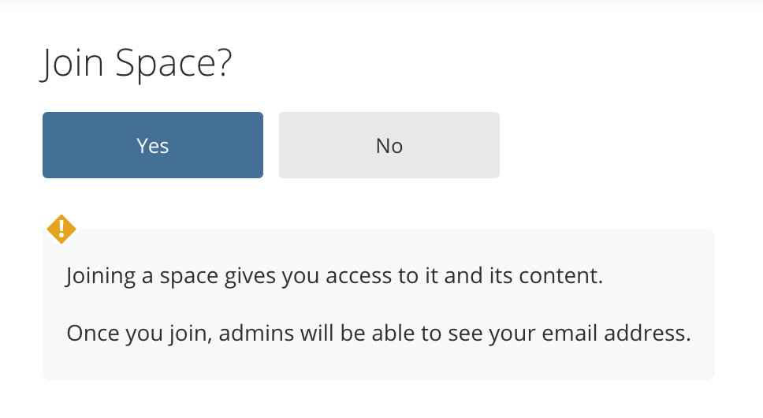
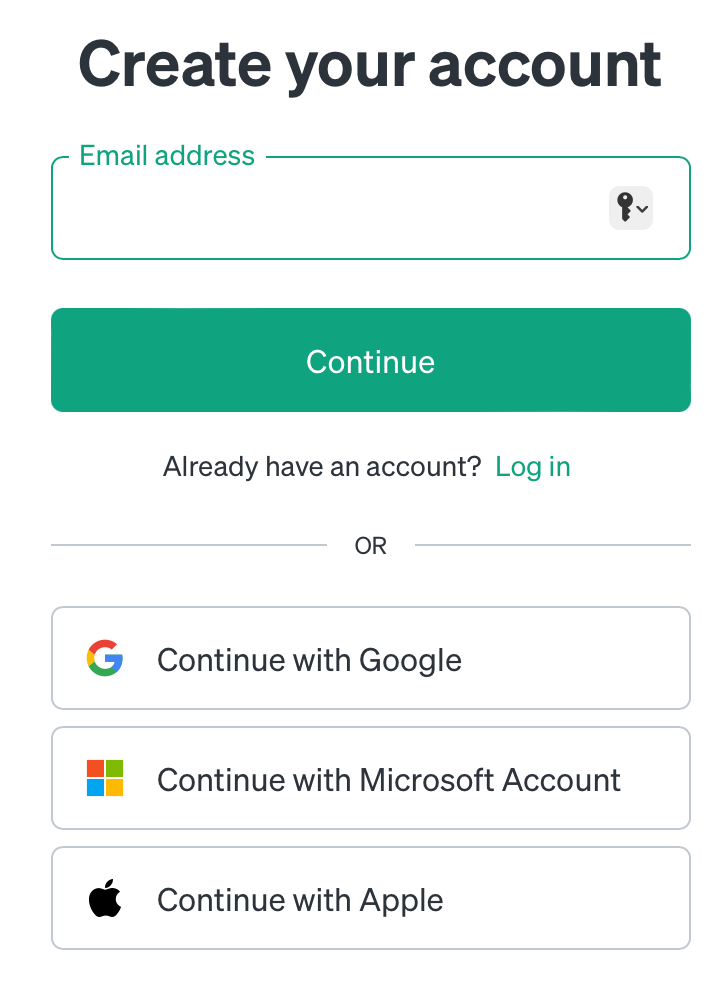
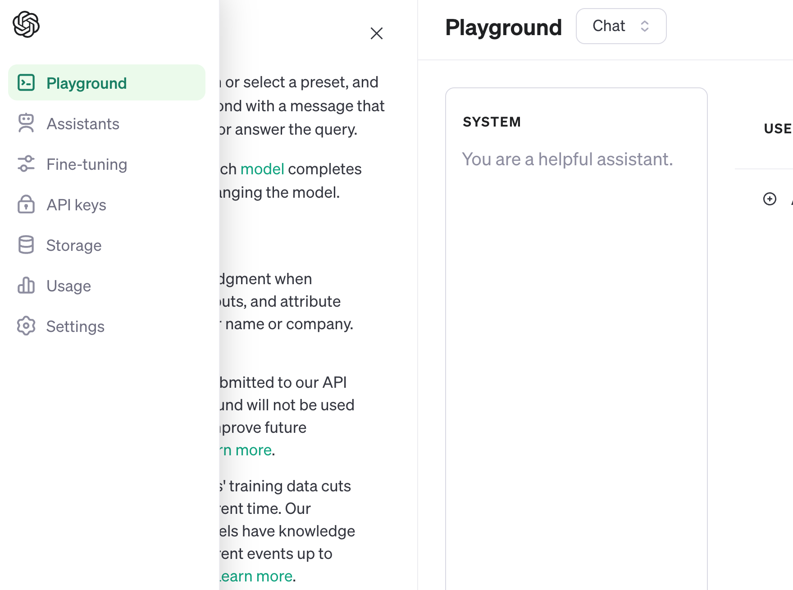
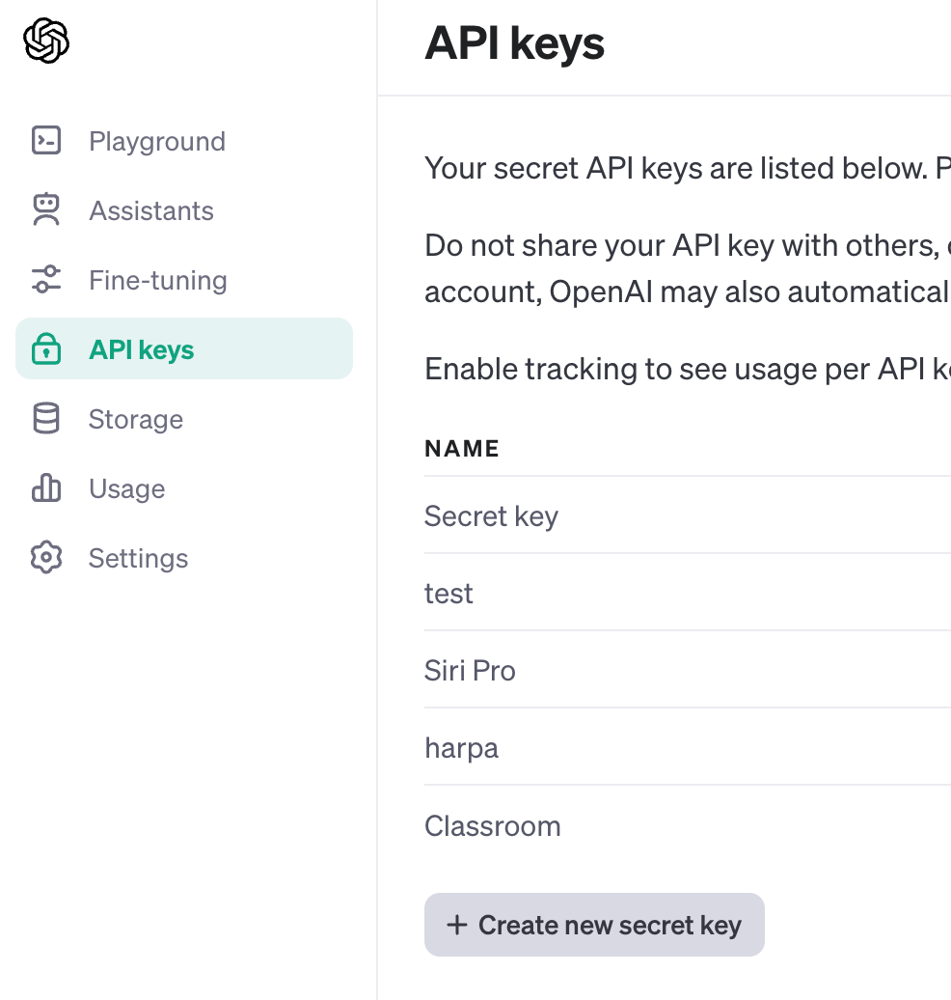

# class 1

- [class 1](#class-1)
- [Goals](#goals)
  - [Google classroom](#google-classroom)
  - [R on the cloud](#r-on-the-cloud)
  - [AI assistant](#ai-assistant)
    - [ChatGPT standalone app](#chatgpt-standalone-app)
    - [OpenAI API](#openai-api)
      - [Playground](#playground)
      - [API key (optional)](#api-key-optional)
    - [Harpa chrome extension (optional)](#harpa-chrome-extension-optional)
    - [Harpa AI](#harpa-ai)
  - [Chrome installation](#chrome-installation)

# Goals

1.  Join Google classroom and fill out the survey of identity.
2.  Join the cloud computing platform [Posit](https://posit.cloud/) and
    join our course workspace.
3.  Setup AI assistant: either ChatGPT or OpenAI API applicant.

## Google classroom

We will use Google classroom to manage the course materials and
assignments. You will find materials:

- Lecture notes (hosted in [GitHub](https://github.com))
- Weekly video recordings
- The class’s cloud computing workspace (hosted in
  [Posit](https://posit.cloud/))

## R on the cloud

We will use the cloud computing platform [Posit](https://posit.cloud/).

1.  Sign up: Go to <https://posit.cloud/> and sign up select the
    free plan.
2.  Join workspace after signing up.

Once you have signed up, you can join our course workspace by clicking
the link below.

<https://posit.cloud/spaces/489032/join?access_code=bJBu7wJ8S95tXFi7kn_b0Dmg4FStW4HBZGM4THJV>

## AI assistant

We will use ChatGPT as our AI assistant. There are two ways to use it:

1.  ChatGPT standalone app
2.  OpenAI API: when you access ChatGPT through other applications.

> When you use a third-party application, you will need to sign up for
> an OpenAI account and get an API key.

Sigup which way you want to use this AI through
<https://platform.openai.com/apps>

### ChatGPT standalone app

You can use ChatGPT standalone app by visiting
<https://chat.openai.com/>

### OpenAI API

#### Playground

In each class, I will post a playground link. You can use this link to
access ChatGPT record of mine.

#### API key (optional)

Get your api key.

### Harpa chrome extension (optional)

A 3rd party application as Chrome extension that uses ChatGPT as an AI
assistant.

You can install Harpa by visiting
<https://chromewebstore.google.com/detail/harpa-ai-automation-agent/eanggfilgoajaocelnaflolkadkeghjp>

### Harpa AI

<https://harpa.ai/>

## Chrome installation

<https://support.google.com/chrome/answer/95346?hl=en&co=GENIE.Platform%3DDesktop#zippy=%2Cwindows>