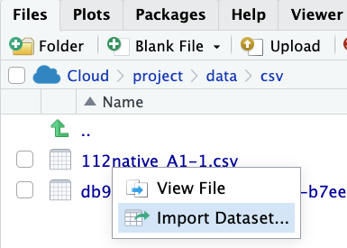

# 前情提要

## AI preset

AI>
```
所有回答使用到程式時一律使用R, 並盡量使用tidyverse語法, 答案以R script呈現  
```

  - 說明會以`#`開頭

## csv檔案的引入

### 範例： 

入載[112學年大專校院原住民學生及畢業生人數](https://data.gov.tw/dataset/33514)的CSV檔，並引入到R


#### 上傳到RStudio


#### 引入外部資料

AI>
```
如何引入csv檔案？
```

#### Key concept: 在RStudio裡可點選CSV檔直接引入



記得更改它在R環境中的名稱


#### 探索資料

> 各學校原住民學士班學生人數


#### Key concept: （AI）清楚交待由什麼物件開始探索資料

  - 使用到R環境裡什麼物件？物件類型（class）是什麼？
  - 要回答這個問題，需要使用這物件裡什麼元素？

AI>
```
`native`這個dataframe裡有"學校名稱"及"在學學生人數_學士班"兩個欄位，計算各學校的原住民學士班學生人數
```

#### Key concept: （AI）出現error把指令和錯誤訊息一起貼去問AI

AI>
```
> library(tidyverse)
Error in library(tidyverse) : there is no package called ‘tidyverse’
```

#### 輸出結果

##### 存成csv檔

##### 存成rds檔

rds檔案是R專用的資料格式，可以儲存R中的任何物件

##### 存到google sheets 

- 只適合data frame
- 小型資料集

> 這裡需要使用到GPT-4或Claude才會得到正確的答案

1. 連到<https://docs.google.com/spreadsheets>
  
2. 創立一個新的試算表, copy它的網址
   
3. 問AI如何將資料存到這個試算表

AI>
```
如何將`result` dataframe存到 {Google Sheets網址}？
```


### 範例完整程式

```
# 引入csv ------

## 安裝並載入 tidyverse 套件 ----
# install.packages("tidyverse")
library(tidyverse)

## 使用 read_csv() 函數引入 CSV 檔案 ----
native <- read_csv("112native_A1-1 (3).csv")

# data2 <- read_csv("data/csv/112native_A1-1.csv")

# 假設 "path/to/your/file.csv" 是你 CSV 檔案的路徑和檔名。
# 如果檔案與你的 R 腳本在同一個資料夾中，則只需提供檔案名稱即可。

# 如果檔案位於其他資料夾中，則需要提供完整的路徑。
# 例如：data <- read_csv("/Users/username/Documents/data.csv")
# 或者：data <- read_csv("C:/Users/username/Documents/data.csv")

# 探索資料----

## 載入 tidyverse 套件 ----
library(tidyverse)

# 假設 relative 是包含學校名稱、在學學生人數_學士班和學年度的資料框
# 如果 relative 是一個 CSV 檔案，可以使用 read_csv() 函數載入資料

## 使用 group_by() 和 summarise() 函數計算不同學校的學士班在學學生人數 -----
result <- native |>
  group_by(學校名稱) %>%
  summarise(學士班在學學生人數 = sum(在學學生人數_學士班, na.rm = TRUE))


# 查看計算結果
print(result)


# 儲存結果 ----

## csv ----

# 載入 readr 套件（tidyverse 已包含 readr 套件）
library(tidyverse)

# 將 result 資料框儲存為 CSV 檔案
write_csv(result, "result.csv")

# 若要儲存到其他路徑，可以提供完整的路徑
# write_csv(result, "/path/to/your/result.csv")

## rds ----
# 將 result 資料框存儲為 RDS 檔案
saveRDS(result, file = "result.rds")

# 若要儲存到其他路徑，可以提供完整的路徑
# saveRDS(result, file = "/path/to/your/result.rds")

## excel ----

# 載入 readxl 套件（tidyverse 已包含 readxl 套件）
library(tidyverse)

# 將 result 資料框存儲為 Excel 檔案
write_excel_csv(result, "result.xlsx")

# 若要儲存到其他路徑，可以提供完整的路徑
# write_excel_csv(result, "/path/to/your/result.xlsx")

## Google sheets ----

### 安裝 googledrive 和 googlesheets4 -----
install.packages("googledrive")
install.packages("googlesheets4")

# 載入对应的套件
library(googledrive)
library(googlesheets4)
# 載入googlesheets4
library(googlesheets4)

# 連結至特定的google工作表
# ss <- drive_get(as_id("https://docs.google.com/spreadsheets/d/1tv8IqRoYm7tFi_K0_gifb1d27i87j2g3ZUnnCR-vnek/edit#gid=217061096"))
ss <- "https://docs.google.com/spreadsheets/d/1tv8IqRoYm7tFi_K0_gifb1d27i87j2g3ZUnnCR-vnek/edit#gid=217061096"

# 將result寫入google工作表的"Sheet2"
result %>% write_sheet(ss, "Sheet2")
```
