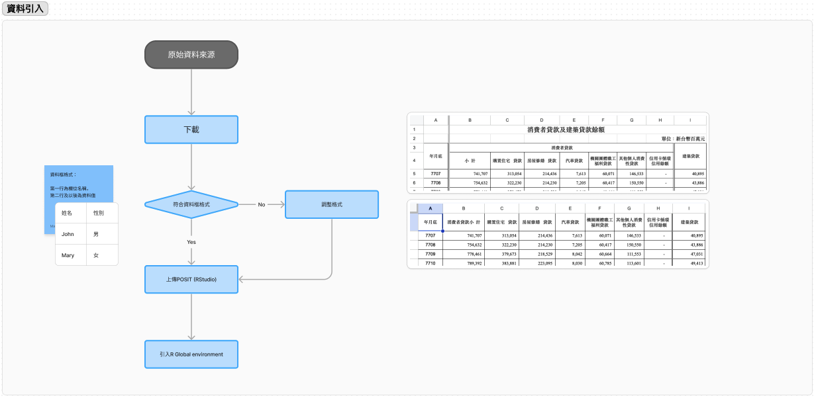
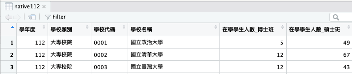
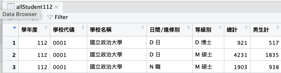
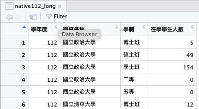
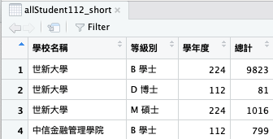

# Recap 水平合併


## 資料引入

[](https://www.figma.com/file/JF501BeiuwS0C1Hz0tfCyh/Untitled?type=whiteboard&node-id=2%3A3686&t=BARRjc7ixXajW9ay-1)


## 資料合併

### 水平合併

一個identity （身份）在data frame只會出現一次

它的經濟意義是由特定欄位值決定。例如：

  - 經濟意義：一個人，由名字、性別、生日等等決定，要同名同姓同性別同生日的人才算是同一個人。
  - 經濟意義：一個公司，由公司名稱、公司地址等等決定，要同名同地址的公司才算是同一個公司。

兩個資料框要能水平合併必需有"同樣義意"的identity。

#### `native112`



一個identity代表一間大學，由學校名稱決定，要同名的學校才算是同一間學校。

#### `allStudent112`



一個identity代表一個學制，它由學校名稱、日間/進修別、等級別決定，要同名、同日間/進修別、同等級別的學制才算是同一個學制。

#### identity轉換

##### 大定義轉小定義

針對identity定義大的進行轉換，"一間大學"包含"好幾個學制"，所以針對"一間大學"的identity進行轉換。

> identity轉換會將大定義的identy轉換為小定義的identity，所以原先的一筆資料會變成很多筆資料，資料框會變"長"，是"長式"轉換，會用到`pivot_longer`函數。

[AI>>](./week10-prompt.md#大定義轉小定義)



一個identity代表一個學制，它由學校名稱、等級別決定，要同名、同等級別的學制才算是同一個學制 -- 注意這裡沒有日間/進修別之分。

##### 小定義轉大定義

一個identity代表一個學制，它由學校名稱、日間/進修別、等級別決定，要轉成一個identity為不分日間/進修別的學制，就是小定義轉大定義。

> identity轉換會將小定義的identy轉換為大定義的identity，所以原先的好幾筆資料（不同日間/進修別，但相同學校名稱，等級別 會變成一筆資料，資料框會變"短" -- 但沒有`pivot_shorter`函數，要小心XDDD。

[AI>>](./week10-prompt.md#小定義轉大定義)



一個identity代表一個學制，它由學校名稱、等級別決定，要同名、同等級別的學制才算是同一個學制 -- 這裡已經沒有日間/進修別之分。

#### 水平合併

[AI>>](./week10-prompt.md#水平合併)

#### 範例程式

```r
library(readr)
# 資料引入 ----

## 利率資料 ----
interest_rate <- read_csv("interest-rate.csv")
## 貸款資料 ----
loan <- read_csv("loan.csv")

# 資料水平合併

## 所有學生 ----
allStudent112 <- read_csv("112_student.csv")

## 原住民學生 ----
native112 <- read_csv("112native_A1-1.csv")

library(dplyr)

# 水平合併-----

## 長式化----
native112_long <- native112 %>%
  pivot_longer(cols = starts_with("在學學生人數"), 
               names_to = "學制", 
               values_to = "在學學生人數") %>%
  mutate(學制 = str_extract(學制, "(?<=_).+"))  # 提取學制名稱

native112_long <- native112_long |>
  select(學年度,學校名稱, 學制, 在學學生人數)

# 瀏覽前3行
glimpse(head(native112_long, 3))

## 短化----
# 將資料精簡並加總相同學校名稱、等級別的數值型欄位
allStudent112_short <- allStudent112 %>%
  group_by(學校名稱, 等級別) %>%
  summarise(across(where(is.numeric), sum))

# 瀏覽前3行
glimpse(head(allStudent112_short, 3))

# 合併 -----
library(dplyr)
library(stringr)

# Remove "班" from the "學制" column in native112_long
native112_long <- native112_long %>%
  mutate(學制 = str_remove(學制, "班"))

# Remove leading whitespace and everything before it from the "等級別" column in allStudent112_short
allStudent112_short <- allStudent112_short %>%
  mutate(等級別 = str_trim(str_extract(等級別, "(?<=\\s).*")))

# Merge allStudent112_short into native112_long based on school name and 學制/等級別
merged_data <- native112_long %>%
  left_join(allStudent112_short, by = c("學校名稱" = "學校名稱", "學制" = "等級別"))

# Display the first 3 rows and structure of the resulting merged data frame
glimpse(head(merged_data, 3))

# Merge allStudent112_short into native112_long based on school name and 學制/等級別
merged_data <- native112_long %>%
  select(-學年度) |>
  left_join(allStudent112_short, by = c("學校名稱" = "學校名稱", "學制" = "等級別"))

# Display the first 3 rows and structure of the resulting merged data frame
glimpse(head(merged_data, 3))
```