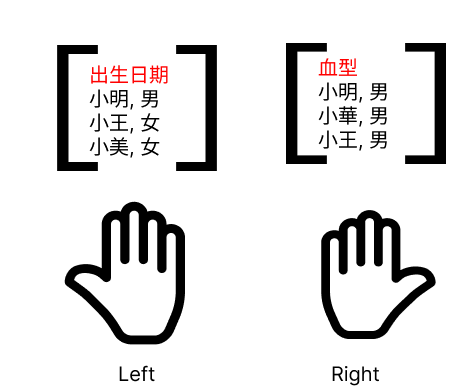
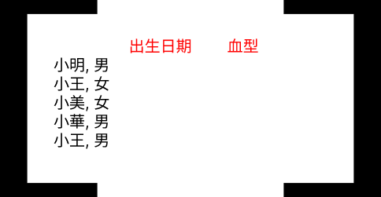

# Recap

## 水平合併前的身份轉換

[week10 範例程式](https://github.com/tpemartin/112-2-R/blob/main/lecture%20notes/week10.md#%E7%AF%84%E4%BE%8B%E7%A8%8B%E5%BC%8F)


# 水平合併




## 合併方式

  - left_join (外部合併): 保留左邊的資料框所有資料，右邊的資料框有對應的資料則合併，沒有則填入NA
  - right_join (外部合併): 保留右邊的資料框所有資料，左邊的資料框有對應的資料則合併，沒有則填入NA
  - inner_join (內部合併): 保留兩個資料框"共"有的資料
  - full_join（完整外部合併）: 保留兩個資料框"所有"資料，有對應的資料則合併，沒有則填入NA

### 合併結果



## id值的一致性

前面我們處理的是身份（identity）「單位」的一致性，這裡我們處理的是id「值」的一致性，例如：兩個資料框的性別欄位，對於男性的記錄必需一致，不能一個是"男"，另一個是"男性"。

AI》
```
allStudent112_short的$等級別，要去除空白及其以前的所有字
```

AI》
```
native112_long的$學制，要去除最後的"班"字
```

[AI》水平合併](./week11-prompt.md#水平合併112)

# 函數

由於程式多是一條直線式的執行（也叫single thread）到底，在每一段直線我們可以看到input（待解決任務的訊息）和output （任務解決後的產出）的影子，例如： 

[](https://www.figma.com/file/JF501BeiuwS0C1Hz0tfCyh/teaching-R?type=whiteboard&node-id=26-155&t=qoKsCm8otfQtDuNQ-4)

## 水平合併109-112學年


- [大專校院原住民學生及畢業生人數—按等級別與校別分](https://data.gov.tw/dataset/33514)  
- [大專院校校別學生數](https://data.gov.tw/dataset/6231)

[AI>>](./week11-prompt.md#水平合併多學年)


