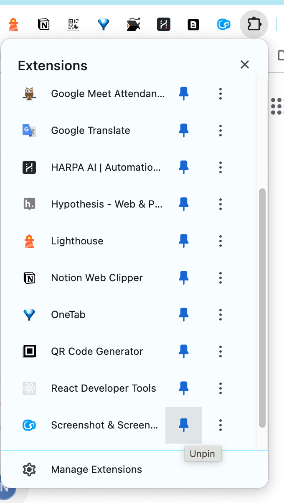
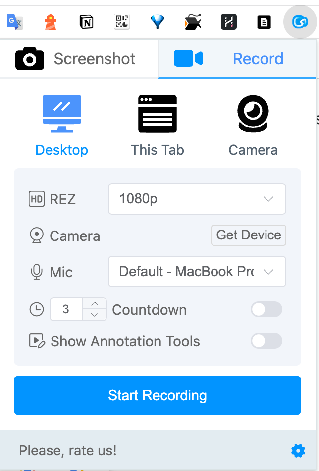
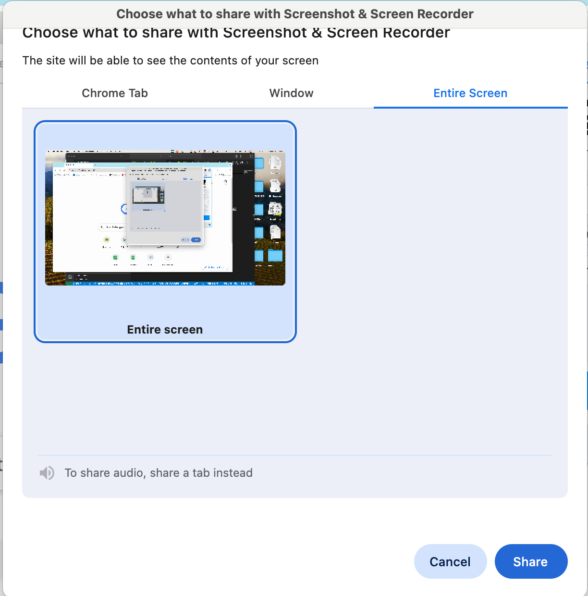

# Final project

  1. 使用ChatGPT及R語言，進行資料分析。
  2. 錄你在RStudio的程式操作過程，並將操作過程的桌面畫面及你的聲音錄製下來。
  3. 影片上傳至YouTube或Vimeo。
  4. ChatGPT的對話文字及R語言程式碼上傳至GitHub。
  5. 線上繳交3與4的連結。

## 如何錄桌面畫面及聲音

  1. 使用chrome瀏覽器，安裝以下擴充：
  <https://chromewebstore.google.com/detail/screenshot-screen-recorde/okkffdhbfplmbjblhgapnchjinanmnij?hl=en>
  2. 釘住擴充
  

  3. 之後要錄桌面只需點擊此擴充圖示，選擇錄製桌面。  
    3.1 點擊擴充圖示

    3.2 選擇錄製桌面

  4. 錄製完畢後，點擊擴充圖示，選擇停止錄製。
  
  5. 點選download存檔。