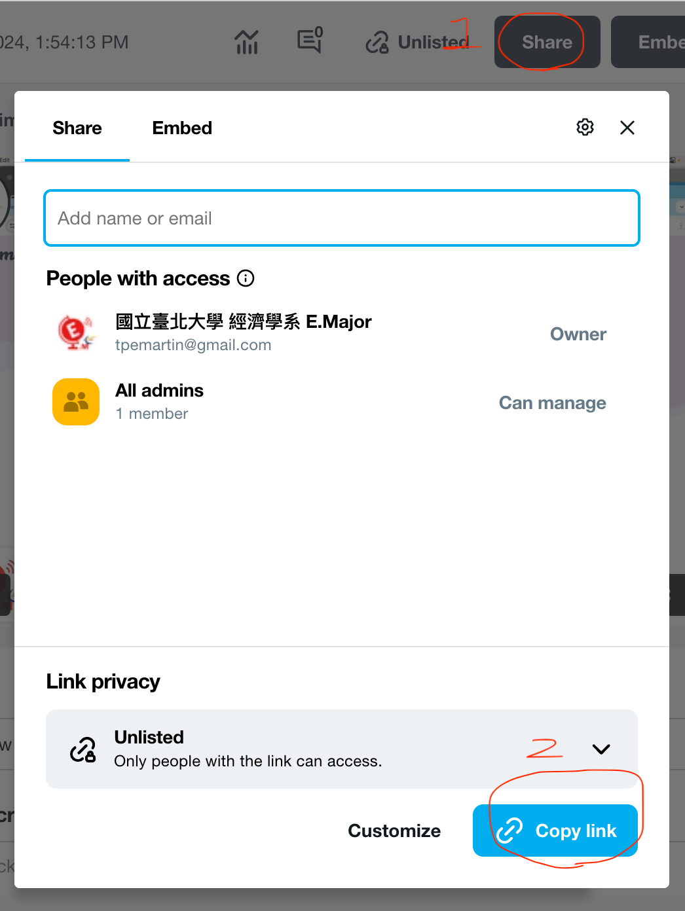

# Final project

  1. 使用ChatGPT及R語言，進行資料分析。
  2. 錄你在RStudio的程式操作過程，並將操作過程的桌面畫面及你的聲音錄製下來。
  3. 影片上傳至YouTube或Vimeo。
  4. ChatGPT的對話文字及R語言程式碼上傳至GitHub。
  5. 線上繳交3與4的連結。

## 如何錄桌面畫面及聲音

  1. 使用chrome瀏覽器，安裝以下擴充：
  <https://chromewebstore.google.com/detail/vimeo-record-screen-webca/ejfmffkmeigkphomnpabpdabfddeadcb>
  2. 釘住擴充
  
  3. 之後要錄桌面只需點擊此擴充圖示，選擇錄製桌面。  
    3.1 點擊擴充圖示，使用GMail登入或加入Vimeo。
    
    3.2 再點擊一次擴充圖示，選擇錄製桌面
    
    
  4. 錄製完成後，點擊停止錄製，等待上傳至Vimeo完成後，點擊分享，複製連結。
  

  > 此連結會長得像： https://vimeo.com/951397788/f95656f948?share=copy  這是你要繳交的影片連結。

## 如何上傳程式及ChatGPT對話記錄至GitHub

### 1. Fork GitHub

開啟 <https://github.com/tpemartin/112-2-R-final-project>
    
  

> 你需要繳交你fork回去的期末專題連結：`https://github.com/{你的帳號}/112-2-R-final-project`

### 2. 取得ChatGPT對話記錄連結

在RStudio開一個新檔案，把連結一一貼上，並存檔。

### 3. 下載RStudio程式, 資料及ChatGPT對話記錄檔

### 4. 上傳至GitHub

